# AI Agent Collaboration System 🤖


## Overview 🎯

This project implements a multi-agent collaboration system where each agent (e.g., Product Owner, CTO) has a distinct persona, knowledge base, and communication style. Agents interact iteratively, leveraging their knowledge and role definitions to solve complex tasks together.

## Features ✨

- **Persona-driven agents** 👥: Each agent has a unique role, communication style, and decision-making framework.
- **Knowledge base integration** 📚: Agents use markdown files and other documents to inform their responses.
- **Markdown diagrams and pseudocode** 📊: Product Owner uses Mermaid flowcharts; CTO uses Mermaid sequence diagrams and pseudocode.
- **Iterative, collaborative dialog** 💭: Agents build on each other's reasoning, resulting in robust, realistic conversations.
- **Emoji-enhanced communication** 😊: Agents use emojis to reinforce their personas and improve clarity.
- **Automated testing** ✅: Includes scripts to test agent communication and knowledge base usage.

## System Architecture 🔧

```mermaid
graph TD
    A[User Input] --> B[Agent System]

    subgraph "Product Owner Agent 👥"
        C[PO Agent] --> C1[PO Knowledge Base]
        C --> C2[PO Role Definition]
        C --> C3[PO Communication Style]
        C --> C4[PO Decision Framework]
    end

    subgraph "CTO Agent 👨‍💻"
        D[CTO Agent] --> D1[CTO Knowledge Base]
        D --> D2[CTO Role Definition]
        D --> D3[CTO Communication Style]
        D --> D4[CTO Decision Framework]
    end

    B --> C
    B --> D

    %% Agent Interactions
    C <--> D
    C -->|Iterative Dialog| D
    D -->|Technical Feedback| C

    %% Output Generation
    C --> E[Response Generation]
    D --> E
    E --> F[User Output]

    subgraph "Staging Tools 🛠️"
        G[Profile Scraper] --> H[Raw Data]
        H --> I[Data Processing]
        I --> J[Processed Data]
        J --> K[Agent Profiles]
        K -->|Updates| C1
        K -->|Updates| D1
    end

    style C fill:#f9f,stroke:#333,stroke-width:2px
    style D fill:#bbf,stroke:#333,stroke-width:2px
    style C1 fill:#f9f,stroke:#333,stroke-width:1px
    style D1 fill:#bbf,stroke:#333,stroke-width:1px
```



## Project Structure 📁

```
agents/
  product_owner/
    agent.py
    knowledge_base/
      documents/
        role.md
  cto/
    agent.py
    knowledge_base/
      documents/
        role.md
core/
  knowledge_base/
    knowledge_manager.py
staging/
  agent_profile_scraper.py
  run_scraper.py
  config.json
  profiles/
  raw_data/
  processed_data/
  dataScrape/
README.md
requirements.txt

```

## Setup 🚀

1. Clone the repository

2. Set up environment variables:

   ```bash
   # Copy the example env file
   cp .env.example .env

   # Edit .env with your configuration
   # Required variables:
   OLLAMA_API_URL=http://localhost:11434
   OLLAMA_MODEL=llama2:13b
   ```

3. Install dependencies:

```bash
  # Create and activate main venv
  python -m venv venv
  source venv/bin/activate  # On Unix/macOS

  # Install main requirements
  pip install -r requirements.txt
```

```bash
# Create and activate staging venv
python -m venv staging/dataScrape
source staging/dataScrape/bin/activate  # On Unix/macOS

# Install staging requirements
pip install -r staging/requirements.txt
```

4. Install and configure Ollama:

   ```bash
   # Install Ollama (if not already installed)
   # For macOS:
   curl https://ollama.ai/install.sh | sh

   # Start Ollama service
   ollama serve

   # In a new terminal, pull the required model
   ollama pull llama2:13b

   # Verify the model is available
   ollama list
   ```

5. Run the test script:
   ```bash
   python test_agents.py
   ```

## Staging Tools 🛠️

The project includes a set of staging tools for data collection and processing:

- **Profile Scraper** 🔍: Collects and processes agent profiles from various sources
- **Data Processing** 📊: Converts raw data into structured formats for agent knowledge bases
- **Logging** 📝: Tracks scraping and processing activities

To use the staging tools:

```bash
cd staging
python run_scraper.py
```

## Configuration ⚙️

- Add or edit knowledge base files in `agents/<role>/knowledge_base/documents/`.
- Update `role.md` to change an agent's persona, style, or knowledge.
- Configure staging tools in `staging/config.json`:
  - Set up profile scraping parameters
  - Configure data processing options
  - Adjust logging settings

## Troubleshooting 🔧

3. **Environment Management Tips**:
   - Always activate the appropriate environment before running scripts
   - Use `pip freeze > requirements.txt` to update requirements
   - Keep environments separate to avoid dependency conflicts
   - Consider using `pip-tools` for more robust dependency management

### LLM Performance Considerations

When running local LLMs (like llama2:13b), be aware of the following:

1. **System Requirements** 💻:

   - Minimum 16GB RAM recommended
   - GPU with 8GB+ VRAM for optimal performance
   - SSD storage recommended for model loading

2. **Performance on Different Systems**:

   - **Mac with Apple Silicon** 🍎:

     - Good performance with Metal acceleration
     - First run may take 1-2 minutes to load model
     - Subsequent runs will be faster

   - **Mac with Intel** 💻:

     - Slower performance, CPU-only
     - Model loading may take 2-3 minutes
     - Consider using smaller models (7B) if performance is an issue

   - **Windows/Linux with NVIDIA GPU** 🖥️:
     - Best performance with CUDA acceleration
     - Model loading typically 30-60 seconds
     - Ensure latest NVIDIA drivers are installed

3. **Common Issues** ⚠️:

   - **Slow First Response**: This is normal as the model needs to load into memory
   - **Out of Memory**: Try using a smaller model or increasing swap space
   - **Model Not Found**: Ensure you've run `ollama pull llama2:13b` successfully
   - **Connection Refused**: Verify Ollama is running with `ollama serve`

4. **Performance Optimization** ⚡:

   ```bash
   # Monitor Ollama's resource usage
   ollama list

   # Check available models and their sizes
   ollama show llama2:13b

   # If needed, use a smaller model
   ollama pull llama2:7b
   ```

## Roadmap 🗺️

### Phase 1: Core System ✅

- [x] Agent communication framework
- [x] Knowledge base management system
- [x] Persona-driven system prompts
- [x] Automated test system for agent communication
- [x] Support for multiple LLM providers (Ollama and Anthropic)

### Phase 2: Agent Knowledge & Reasoning ✅

- [x] Role-specific knowledge base integration
- [x] Markdown diagram and pseudocode support in agent responses
- [x] Emoji-enhanced, persona-driven communication
- [x] Iterative, collaborative dialog between agents
- [x] Grading and evaluation of agent conversations

### Phase 3: Advanced Features 🚀

- [x] Profile scraping and data collection system
- [x] Automated data processing pipeline
- [ ] Natural language querying of knowledge base
- [ ] More realistic, informal, or adversarial dialog
- [ ] Integration with external APIs and tools (gh, notion etc)
- [ ] UI for visualizing agent conversations and diagrams
- [ ] Enhanced profile analysis and categorization
- [ ] Automated knowledge base updates from collected data

## Grading & Evaluation Checklist 📋

- [x] **Knowledge base usage** 📚: Agents reference and use their role-specific knowledge base files
- [x] **System prompt adherence** ✅: Agents follow their persona, style, and decision-making framework
- [x] **Dialog quality** 💭: Agents build on each other's reasoning, resulting in cohesive, iterative conversations
- [x] **Diagram and pseudocode usage** 📊: Product Owner uses flowcharts; CTO uses sequence diagrams and pseudocode
- [x] **Emoji and persona clarity** 😊: Communication is engaging and persona-driven
- [x] **Real-world applicability** 🌍: Dialog is robust, clear, and suitable for real-world scenarios

---

_Last graded: A — System demonstrates robust, persona-driven, knowledge-based dialog with clear, collaborative reasoning and visual aids._ 🏆
